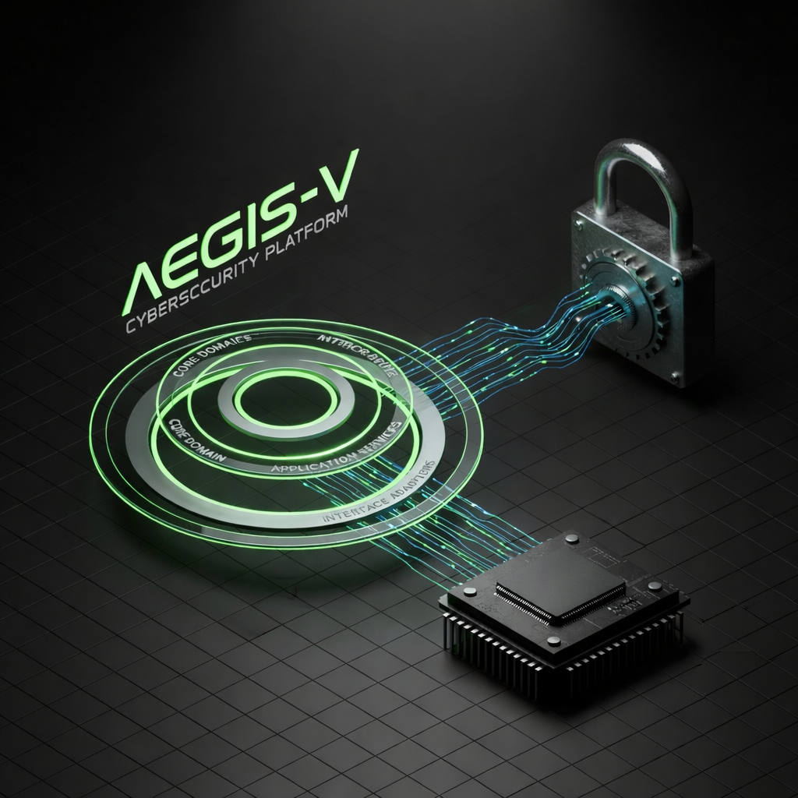
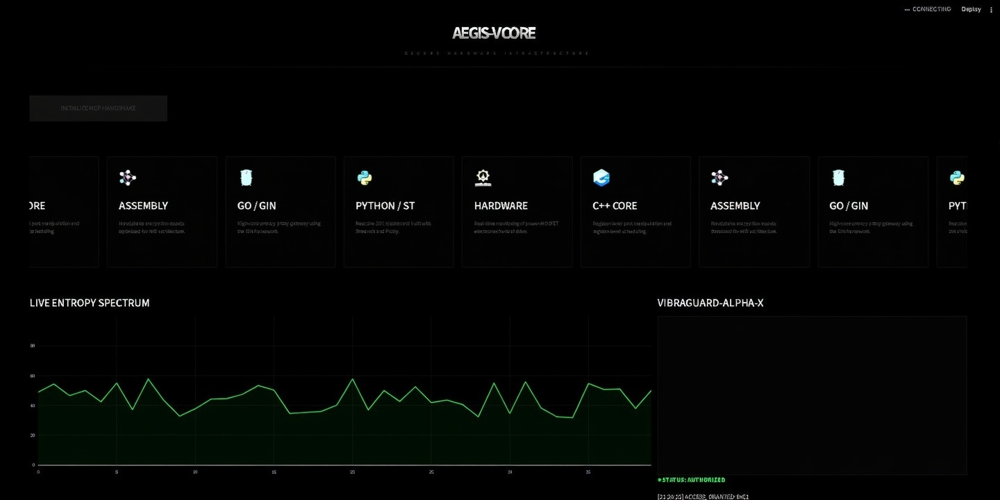
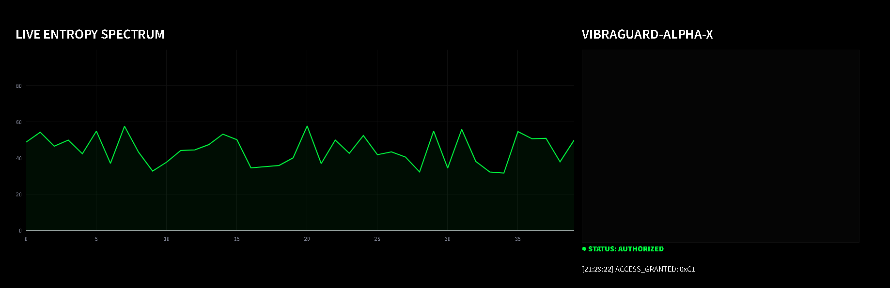

# 🛡️ AEGIS-V: Hardware-Enforced Security Mesh

[](https://gin-gonic.com/)
[](https://streamlit.io/)
[](https://github.com/)

**AEGIS-V** is a high-integrity security gateway that implements **Clean Architecture** to bridge high-level cloud dashboards with low-level hardware root-of-trust.

---

## 📖 Project Overview

Modern security often fails because it stays strictly in the software layer. AEGIS-V moves the "Secret" to a physical **Smart Endpoint**. Using a **Dumb Pipe** philosophy for communication, the system ensures that business rules and cryptographic decisions are made at the edges (Hardware and Core Logic), keeping the transmission layer simple and secure.

### How it Works:
1. **The User** triggers a request via the **Python SOC Dashboard**.
2. **The Go Gateway** (using Gin) acts as an Interface Adapter, converting the request into a cryptographic challenge.
3. **The Hardware (Smart Producer)** receives the challenge, processes it via an **Assembly Cipher**, and decides if the physical lock (Solenoid) should be actuated.
4. **Clean Architecture** ensures that the core security rules are decoupled from the frameworks, allowing the system to run on different hardwares or cloud providers seamlessly.

---

## 🛠️ Prerequisites & Requirements

### Software Requirements
*   **Go**: v1.20 or higher.
*   **Python**: v3.9 or higher.
*   **C++ Compiler**: PlatformIO or Arduino IDE (for firmware deployment).
*   **Git**: To clone and manage the repository.

### Hardware Requirements (Physical Mode)
*   **Microcontroller**: ATmega328P (Arduino Uno, Nano, or Pro Mini).
*   **Interface**: MOSFET IRF540N (for electromechanical triggering).
*   **Actuator**: 5V/12V Solenoid or simple LED for status verification.
*   **Pinout**: Digital **Pin 12** (PB4) for output signal.

---

## 🏗️ System Architecture

Our implementation follows the **Clean Architecture** circles to ensure maintainability and security:

- **Entities**: Pure Domain Objects representing sensor measurements and security states.
- **Use Cases**: Physical simulation logic and anomaly detection criteria.
- **Interface Adapters**: Go Gin routes and Python Streamlit connectors that translate external data to the Core.
- **Frameworks & Drivers**: The actual Hardware (ATmega328P), HTTP engine (Gin), and UI (Streamlit).

---

## 📸 Visual Showcase

### 1. General System Schematic

> **Description:** A global view of the interaction between Clean Architecture layers and physical electromechanical components.

### 2. Operational SOC Dashboard

> **Description:** Main interface for the Security Operations Center, featuring dark-mode industrial aesthetics.

### 3. Hardware Telemetry & Entropy Analysis

> **Description:** Real-time Plotly charts monitoring hardware signal stability and side-channel entropy.

### 4. System Operation Demo

> **Description:** Dynamic feature matrix and live handshake demonstration.

---

## 🔧 Installation Manual

### 1. Firmware Deployment (Hardware Layer)
1. Navigate to `core-firmware/src/`.
2. Open the project in your preferred IDE (Arduino IDE or PlatformIO).
3. Ensure `cipher.S` is in the same directory as `main.cpp`.
4. Connect your hardware via USB and **Flash** the code.
5. **Pinout Note**: Digital Pin 12 (PB4) is used for Solenoid/MOSFET control.

### 2. Backend Engine Setup (API Layer)
The engine manages the "Smart Endpoint" logic and security proxying using the Gin Framework.
1. Enter the gateway directory:
   ```bash
   cd gateway-proxy
   ```
2. Install Go dependencies:
   ```bash
   go mod tidy
   ```
3. Run the backend:
   ```bash
   go run main.go
   ```
   _The server will start at http://localhost:8080._

### 3. Frontend SOC Setup (UI Layer)
The dashboard provides real-time monitoring and command execution.

1. Enter the dashboard directory:
   ```bash
   cd soc-dashboard
   ```
2. Install Python requirements:
   ```bash
   pip install -r requirements.txt
   ```
3. Launch the application:
   ```bash
   streamlit run app.py
   ```

### 🧪 Testing & Verification
To ensure the system is correctly configured, follow these steps:
1. **API Check:** Open your browser and go to `http://localhost:8080/api/health`. You should receive a `{"status": "online"}` response.
2. **Handshake Test:** On the Dashboard, click "**INITIALIZE MCP HANDSHAKE**".
   - The "Authorized" status should turn green.
   - The log terminal should record the specific hex code returned by the Assembly core.
3. **Graph Interaction:** Hover over the Entropy Chart. You can use the Plotly toolbar to zoom in on signal peaks or reset the view.

## 🛠️ Implementation Details
- **Zero-Trust:** No request is trusted without a physical hardware handshake.
- **Concurrency:** Go routines manage multiple hardware nodes simultaneously.
- **Low-Level Mastery:** Cryptographic rounds implemented in** AVR Assembly** to prevent side-channel timing attacks.
- **Electromechanics:** Real-time MOSFET thermal tracking and solenoid pulse-width modulation (PWM).

## 👤 Author
Developed by **zckLab**
_"Securing the digital world by anchoring it in the physical reality."_
